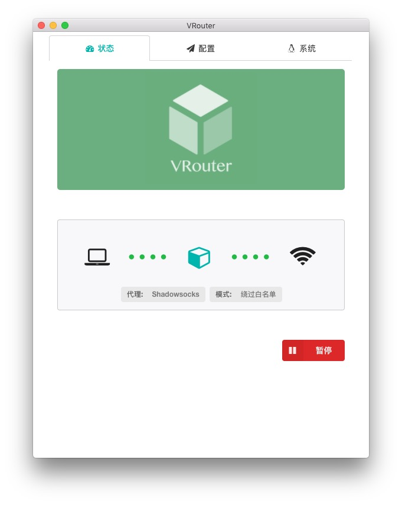
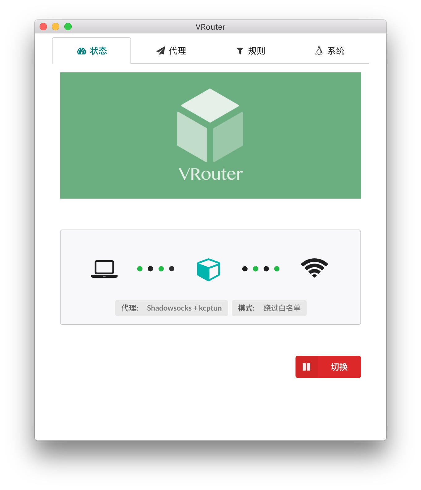

<div style="text-align:center;background-color:#6bae7f">

</div>

### VRouter

一个基于 Virtualbox 和 openwrt 构建的项目, 旨在实现 OS X / macOS 平台上的透明代理.

VRouter 在后台运行一个 openwrt 的虚拟机, 通过更改系统的默认路由, 将所有系统数据包转发到虚拟机上. 依托 openwrt 的 iptables 进行数据包的处理.

了解构造过程请点击: [构造过程](https://icymind.com/virtual-openwrt/)

### 如何使用

前提条件: 

1. 因为需要转发DNS查询, 所以Shadowsocks 的服务端需要开启 udp 转发: 如果是服务端是用命令行启动, 请确保带了 `-u` 参数; 如果是用配置文件, 请确保配置文件包含: `"mode": "tcp_and_udp"`
2. 确保上游路由器开启了DHCP.

使用:

1. 下载运行, 填写相应的代理参数
2. 点击"切换"按钮, 切换网关为 VRouter

### 自定义黑白名单

- 每个域名/IP/IP段一行, 注释行以#开头
- 域名
    - 域名可以是裸域名如 `example.com`, 将会匹配该域下的所有子域名如  `a.example.com`, `b.example.com` 等等
    - 也可以填写子域名如 `a.example.com`, 如此不会匹配到 `b.example.com`
- IP
    - 可以是独立的IP, 如 `123.123.123.123`
    - 也可以是IP段, 如 `123.123.123.0/8` 将会匹配 `123.123.123.0~123.123.123.255` 之间的IP地址. `123.123.0.0/16`将匹配 `123.123.0.0 ~ 123.123.255.255`之间的IP地址

### 恢复网关

如果出 bug 造成无法上网或者无法解析域名, 而 VRouter 又无法恢复系统默认网关.可以手动恢复:

```bash
# 查找你的路由器地址, 假设命令输出1.2.3.4
/usr/sbin/networksetup -getinfo Wi-Fi | grep Router

# 恢复网关, 1.2.3.4 换成第一条命令的输出
sudo /sbin/route change default 1.2.3.4

# 恢复DNS, 1.2.3.4 换成第一条命令的输出
sudo networksetup -setdnsservers Wi-Fi 1.2.3.4

# 确认网关已恢复
/usr/sbin/netstat -nr | grep default | awk '{print $2}'

# 确认DNS已恢复
/usr/sbin/networksetup -getdnsservers Wi-Fi
```

### FAQ

#### 为什么不直接用 shadowsocks 客户端?

使用客户端很方便, 但是仍然有以下的不足

- 每个需要代理的软件都要逐一设置.
- 命令行软件虽然可以用 `export http_proxy` 的方式使用代理, 但有时并不管用. 需要进一步折腾 Proxifier 或者 Privoxy
- 有些软件并不支持设置代理, 如系统自带的 Mail APP.

#### 好吧, 那为什么不在路由器上设置代理?

在路由器设置代理解决了客户端的不足, 但是也有局限性.

- 如果路由器性能不足, 使用 kcptun 等软件时, 负载会非常高. 而且速度比在桌面端运行 kcptun 慢很多.
- 路由器只能在固定地点使用, 便携性差.

#### 后台运行虚拟机, 会不会太耗能?

虽然是虚拟机, 但其实非常轻量. openwrt 官网提供的镜像不足 5MB, 转化为 virtualbox 虚拟机磁盘文件, 并在虚拟机上安装必要的软件后, 磁盘空间占用不足 30M. 全天候使用内存占用在 100MB 以内, CPU 占用率一般情况下为 5% 左右 (MacBook Pro Retina, 13-inch, Mid 2014), 开启 kcptun 看油管的 1080P 时, CPU 占用率波动性较大, 在 5%~30% 之间, 目测平均值在 15% 左右.

#### 跟 surge/Specht 对比有何优劣?

开源的 Specht 一直没有开发者签发, 所以在 OSX 上暂不能使用. VRouter对比 surge, 缺点是:

- 需要安装虚拟机
- 无法在移动端使用

优点是:

- 免费

#### 所以, VRouter 的优缺点是?

优点:

- 可以实现透明代理
- 性能不受局限
- 便携性良好, 随笔记本移动
- 资源占用小
- 切换方便
- 免费

缺点:

- 需要先安装virtualbox
- 无法服务局域网内的其他设备

### TODO

- [x] 优化黑白名单的处理
- [ ] 增加log
- [ ] 更新gfwlist
- [ ] 增加转发tcp/udp的配置入口
- [ ] 集成ssr
- [ ] 增加功能: 更新集成的软件
- [ ] updater
- [ ] Windows 适配
- [ ] 系统状态栏

### 截图




