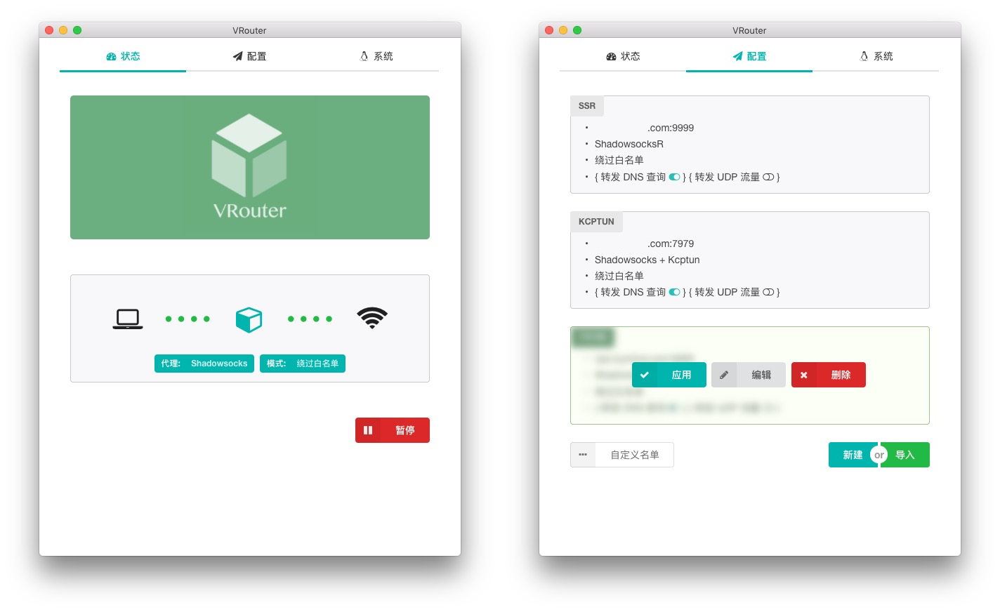
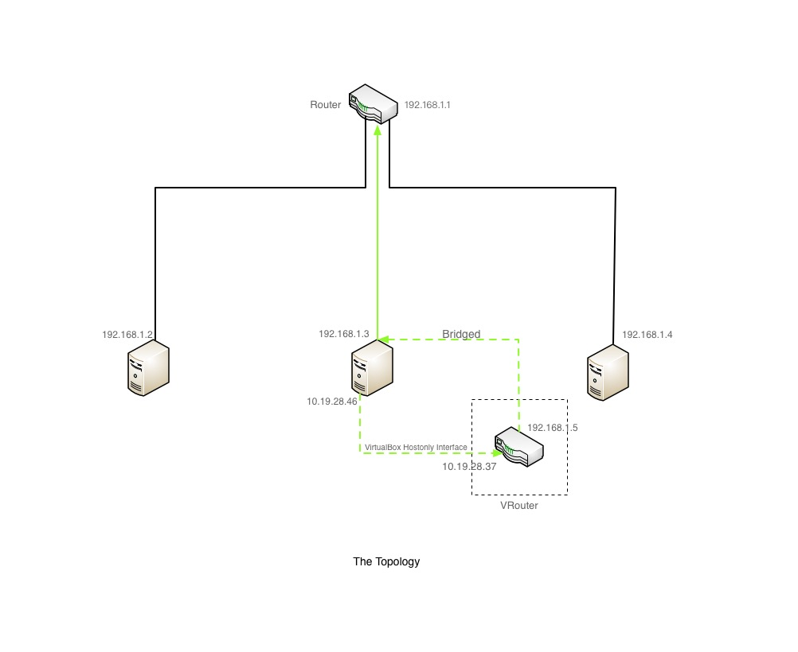

### VRouter

一个基于 Virtualbox 和 openwrt 构建的项目, 旨在实现 macOS / Windows 平台上的透明代理.

VRouter 在后台运行一个 openwrt 的虚拟机, 通过更改系统的默认路由, 将所有系统数据包转发到虚拟机上. 依托 openwrt 的 iptables 进行数据包的处理.

了解[构造过程](https://icymind.com/virtual-openwrt/)

### 如何使用

前提条件:

1. 为了能在服务端进行 DNS 查询, 请确保 ss-server 开启了 UDP 转发.
2. 为了能确保虚拟机可以联网, 确保上游路由器开启了 DHCP, 或者给 VRouter ( mac地址: 889988998899 ) 分配一个静态 IP.

### 自定义黑白名单

- 每个域名/IP/IP段一行, 注释行以#开头
- 域名
    - 域名可以是裸域名如 `example.com`, 将会匹配该域下的所有子域名如  `a.example.com`, `b.example.com` 等等
    - 也可以填写子域名如 `a.example.com`, 如此不会匹配到 `b.example.com`
- IP
    - 可以是独立的IP, 如 `123.123.123.123`
    - 也可以是IP段, 如 `123.123.123.0/8` 将会匹配 `123.123.123.0~123.123.123.255` 之间的IP地址. `123.123.0.0/16`将匹配 `123.123.0.0 ~ 123.123.255.255`之间的IP地址

### 项目的意义

#### 为什么需要透明代理?

使用 Shadowsocks 桌面客户端可以很方便地进行非透明代理, 但是仍然有以下的不足

- 每个需要代理的软件都要逐一设置
- 命令行软件虽然可以用 `export http_proxy` 的方式使用代理, 但有时并不管用. 需要进一步折腾 Proxifier 或者 Privoxy
- 有些软件并不支持设置代理, 如 macOS 系统自带的 Mail APP
- 有些游戏场景需要透明的 UDP 代理

#### 为什么不在路由器上设置透明代理?

强烈推荐在路由器设置透明代理. 但是, 在路由器透明代理虽然解决了客户端的不足, 仍然有其局限性.

- 如果路由器性能不足, 使用 kcptun 等软件时, 负载会非常高. 而且速度比在桌面端运行 kcptun 慢很多
- 路由器只能在固定地点使用

#### 用虚拟机会不会有点杀鸡用牛刀?

大材小用确实有点委屈了虚拟机. 幸运的是 openwrt 非常轻量, 官网提供的镜像不足 5 MB, 转化为 virtualbox 虚拟机磁盘文件, 并在虚拟机上安装必要的软件后, 磁盘空间占用不足 30 MB. 虚拟机在 macOS 上的内存占用在 150MB 以内, 在 Windows 上的内存占用仅仅 20 MB 左右. CPU 占用率则跟网络流量正相关, 没有流量的情况下, Windows 版本 CPU 占用率接近 0% ( 2010 年的 Thinkpad ), macOS则是在 5% 以下 ( 2014 年的中端 13 寸 Macbook).

#### 优缺点

优点:

- 可以实现 TCP / UDP 的透明代理
- 性能不受局限
- 便携性良好, 随笔记本移动
- 切换方便
- 免费

缺点:

- 依赖 VirtualBox
- 无法服务局域网内的其他设备
- [ Windows ] Edge 浏览器和 UWP 应用无法连接网络
- [ Windows ] 因为 Windows 非常不尊重路由表, 只能"软禁用"物理网卡, 因此宿主会变成 VRouter 下的设备, 网络邻居将无法找到宿主.

### 拓扑结构

